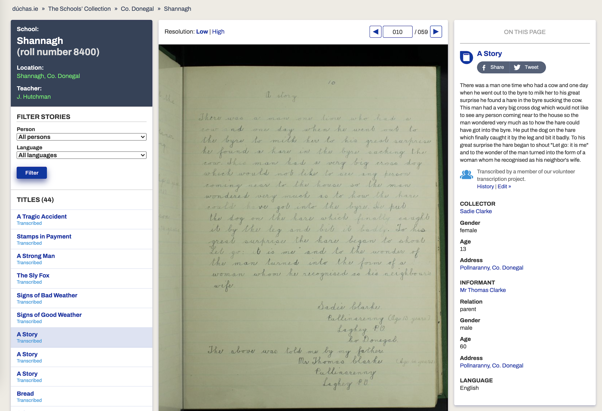

# The Schools' Collection Dataset
Fascinating text data tagged by topic, data collector (Irish children in the late 1930s), informant (the person they're interviewing), and location; data from from The Schools' Collection -- "a collection of folklore compiled by schoolchildren in Ireland in the 1930s." (https://www.duchas.ie/en/cbes)

According to https://www.duchas.ie/en/info/cbe: "Approximately 740,000 pages (288,000 pages in the pupils’ original exercise books; 451,000 pages in bound volumes) of folklore and local tradition were compiled by pupils from 5,000 primary schools in the Irish Free State between 1937 and 1939."

"This collecting scheme was initiated by the Irish Folklore Commission, under the direction of Séamus Ó Duilearga and Séan Ó Súilleabháin, Honorary Director and Registrar of the Commission respectively, and was heavily dependent on the cooperation of the Department of Education and the Irish National Teachers’ Organization. It was originally to run from 1937 to 1938 but was extended to 1939 in specific cases. For the duration of the project, more than 50,000 schoolchildren from 5,000 schools in the 26 counties of the Irish Free State were enlisted to collect folklore in their home districts. This included oral history, topographical information, folktales and legends, riddles and proverbs, games and pastimes, trades and crafts. The children recorded this material from their parents, grandparents and neighbours."

"The scheme resulted in the creation of over half a million manuscript pages and is generally referred to as ‘Bailiúchán na Scol’ or ‘The Schools’ Collection’."

"There are 1,128 volumes, numbered and bound, in the Collection. A title page prefaces material from each school, giving the name of the school, the parish, the barony, the county and the teacher. A further collection of approximately 40,000 of the children’s original copybooks are stored at the NFC."

## Forward to The Schools' Collection:

### Excerpt:
(Link to scanned pdf: https://www.duchas.ie/download/17.01.26-irish-folklore-and-tradition.pdf)

"The collection of the oral traditions of the Irish people is a work of national importance. It is but fitting that in our Primary Schools the senior pupils should be invited to participate in the task of rescuing from oblivion the traditions which, in spite of the vicissitudes of the historic Irish nation, have, century in, century out, been preserved with loving care by their ancestors. The task is an urgent one for in our time most of this important national oral heritage will have passed away for ever."

"In every rural school in Ireland the children will vie with one another in collecting from their parents and friends these traditions, and with the friendly help and encouragement of the teachers there is no doubt that a huge body of very valuable information will be recorded from every part of the country."

"First of all it must be stressed that very great importance is attached to the recording of variants of the same story, tradition, belief, custom, etc., from every district in the country. From this huge mass of variant material it will be possible for scholars to show geographical distribution of certain aspects of our oral traditions. For example, it may be discovered that a custom, belief, or story is confined to a certain area, or again, it may be found from a study of hundreds of variants of the same story, that a certain international folk-tale which is known to have three distinct types, a Central European type, an Eastern European type, and a type mainly associated with Western Europe, occurs in one or more of these types in Ireland, associated according to type with different regions of the country. Then the question will arise as to why a story which is found perhaps in Kerry and certain districts of Cork and Limerick is only known to science elsewhere from South-Eastern Europe."

"In the same way, customs and beliefs, which in a conservative country like ours come down from the Bronze Age as well as from the Early Christian Period, will throw light on our relations with the outside world during these two periods of our history."

"There is also in Ireland a rich amount of material which is medieval in origin. Take, for example, the stories which, it is thought, were introduced from the East of Europe through the influence of the preachers of the Contemplative Orders from the twelfth century onwards. A study of these stories, known as *exempla*, will be of great importance to students of Medieval Irish Literature."

"But apart from all this, the social life of the country people—the historic Irish nation—is mirrored in what is known in Irish-speaking districts as *seanchas* and but little attention has been paid to this type of oral tradition in the past. Due to the lack of documentary evidence the story of the Irish countryman will never be known unless all this *seanchas*, in English and in Irish, *in all its variants*, is recorded from every townland in Ireland."

"When this urgent task of collecting is over a vast store of immensely important material will be available to research. We appeal to the children of the Primary Schools and to their teachers to help in this great work."

"In writing down these traditions the standpoint should be taken that this is the first time, and perhaps the last time, that they will be recorded."

"The children should remember that very little is known about the traditions of their district and they should record everything which throws a light on these traditions. It does not matter for the carrying out of this scheme whether similar traditions have been written down already. Even if it is believed that certain people have recorded them before, the only safe standpoint for teachers and pupils to take is to proceed as if nothing had been recorded in the district, and to remember that if they do not record the material it will die and be forgotten as if it had never been."

- - - -

# Data collection

**
Screenshot of an example data entry.**

## Project Staff from The Dúchas Project

https://www.duchas.ie/en/info/team

## See also:

* Magan, M. (2018, March 17). **Ireland's darkest, oddest and weirdest secrets uncovered.** Retrieved from https://www.irishtimes.com/life-and-style/people/ireland-s-darkest-oddest-and-weirdest-secrets-uncovered-1.3418059

* Koay A., Shannon F., Sasse A., Heinrich M. and Sheridan H. (2020) **Exploring the Irish National Folklore Ethnography Database (Dúchas) for Open Data Research on Traditional Medicine Use in Post-Famine Ireland: An Early Example of Citizen Science.** *Front. Pharmacol.* 11:584595. doi: [10.3389/fphar.2020.584595](https://www.frontiersin.org/articles/10.3389/fphar.2020.584595/full).
   + recent paper describing this as an early of citizen science
